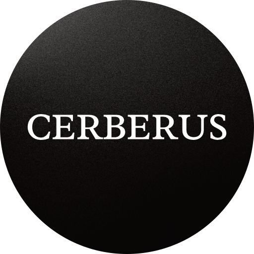
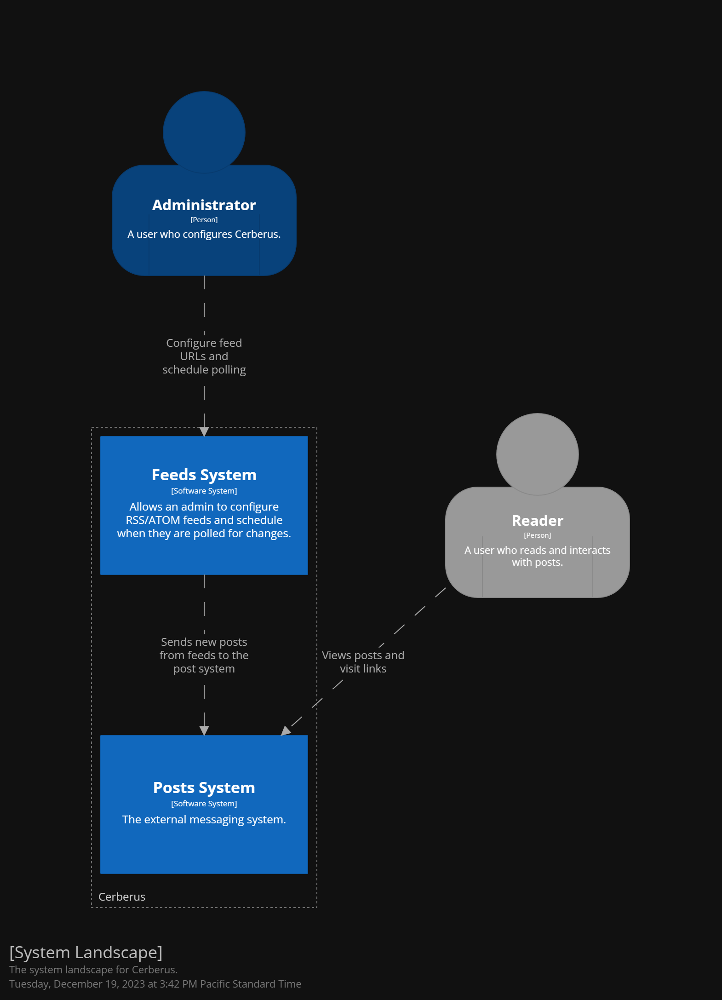

<!-- PROJECT LOGO -->
 

  
  <h3 align="center">Cerberus</h3>
  

    Serverless "Watchdog" for RSS/ATOM/JSON feeds that pushes new entries to a discord server. Hosted on Deno Deploy. CLI manages the service configuration.
     
    <a href="https://github.com/TheDolentCity/cerberus/docs/architecture"><strong>Explore the docs »</strong></a>
  

  
Table of Contents

  <ol>
    <li><a href="#about-the-project">About The Project</a></li>
    <li><a href="#getting-started">Getting Started</a></li>
    <li><a href="#prerequisites">Prerequisites</a></li>
    <li><a href="#installation">Installation</a></li>
    <li><a href="#built-with">Built With</a></li>
    <li><a href="#license">License</a></li>
  </ol>

## About The Project
Cerberus is a serverless microservice that polls a list of RSS/ATOM feeds for new entries and posts them to users via Discord.

(<a href="#readme-top">back to top</a>)

## Built With
- [TypeScript](https://www.typescriptlang.org/)
- [Redis](https://redis.io/)
- [Deno](https://deno.com/)
- [Deno Deploy](https://deno.com/deploy)
- [Upstash](https://upstash.com/)
- [Discord Webhooks](https://discord.com/developers/docs/resources/webhook)

(<a href="#readme-top">back to top</a>)

## Getting Started
- Clone and publish the repository
- Create a new Webhook in the Discord server that posts will be sent to.
- Create a new Redis DB in Upstash.
- Create a new Deno deployment connected to the repository you published.
- Create a local `.env` file based on `.env.example`. Update the `DISCORD_WEBHOOK_URL` variable with the value from the Discord webhook you created earlier. Update the `REDIS` and `QSTASH` environment variables based on your Upstash DB and QStash configuration.
- Use the CLI `addFeed` command to add a valid RSS/ATOM URL feed to the database. Do this for each feed you wish to watch. Example: `deno run --allow-env --allow-net --allow-read cli.ts addFeed --feed=https://example.com`
- Create a new scheduled message in Upstash. The URL should be the deployment URL from Deno Deploy. Schedule the message to fire every ten minutes.
- Update the environment variables in Deno Deploy with the values you earlier placed in the `.env` file.

## Prerequisites
To deploy the application you'll need an Upstash and Deno Deploy account.

## License
Distributed under the MIT License. See `LICENSE.txt` for more information.

(<a href="#readme-top">back to top</a>)
